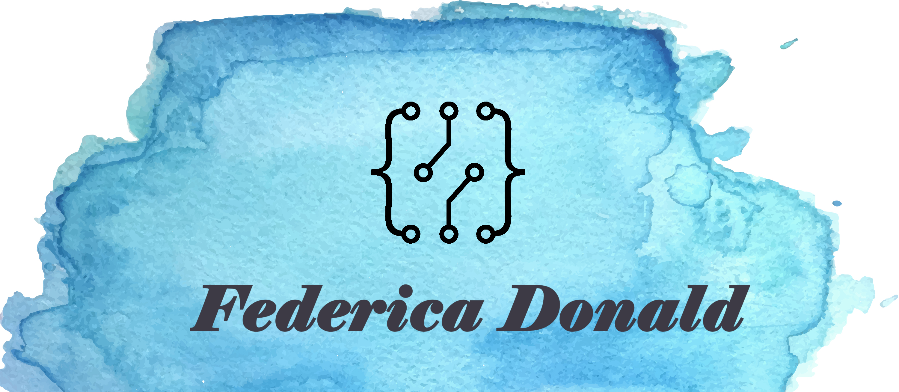

### Hi there 👋 My name is Federica Donald

I'm a final year student studying a bachelors in Electrical and Electronic Engineering. I've also self taught myself web development skills (full stack) as well as Java. My proficiency in languages can be seen below. When I'm not working towards my degree or doing one of my coding side projects, you can find me watching YouTube videos of professional players so I can improve my gaming skills. I'm also an avid swimmer and used to train competetively so I regularly go to the gym and swim to keep up both my physical and mental fitness. 

:star::star::star::star: C++  
:star::star::star::star: Front-end development (HTML, CSS, JavaScript, Bootstrap) 
:star::star::star::star: Back-end development (Node.js, MongoDB, Express) 
:star::star: Java 
:star::star: C# 
:star::star: C 

## :lab_coat: I'm currently working on... 

<ul>
  <li>I'm currently working with ROS creating a widget for a dockable rviz panel. As I come to the end of my placement, I'll be returning to university to finish my final year and gain my BEng. </li>  
<li>I'm also working on creating another game using Unreal Engine 4. This is still being developed, the idea behind is a fantasy/magical realm RPG with multiple characters for players to choose from. </li>
</ul>

You can reach me on LinkedIn  <a href="https://www.linkedin.com/in/federica-donald-931241162/" ><a/>
<!--
**fedtried/fedtried** is a ✨ _special_ ✨ repository because its `README.md` (this file) appears on your GitHub profile.

Here are some ideas to get you started:

- 🔭 I’m currently working on ...
- 🌱 I’m currently learning ...
- 👯 I’m looking to collaborate on ...
- 🤔 I’m looking for help with ...
- 💬 Ask me about ...
- 📫 How to reach me: ...
- 😄 Pronouns: ...
- ⚡ Fun fact: ...
-->
